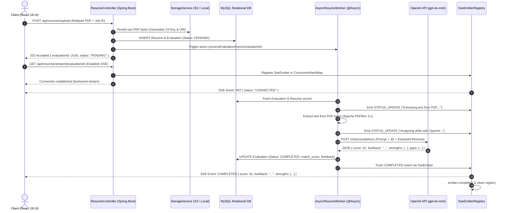

# HireScope ATS &mdash; Enterprise Candidate Document Screener &amp; Applicant Tracking System

[](https://www.oracle.com/java/)
[](https://spring.io/projects/spring-boot)
[](https://spring.io/projects/spring-data-jpa)
[](https://www.mysql.com/)
[](https://react.dev/)
[](https://html.spec.whatwg.org/multipage/server-sent-events.html)
[](https://openai.com/)
[](https://ganesh-badar.github.io/ai-resume-screener-ats/)

An enterprise-grade, asynchronous **AI-Powered Resume Screener & ATS** engineered with **Spring Boot 3**, **React 18**, **Server-Sent Events (SSE)**, **Apache PDFBox 3.x**, and **OpenAI API (GPT-4o-mini)**.

Designed specifically to solve **Servlet Thread Starvation** and **HTTP Connection Timeouts** during heavy LLM evaluations by implementing the **Asynchronous Request-Reply Pattern (HTTP 202 Accepted)** combined with reactive real-time event streaming and a modern dual-theme user interface.

---

## 🌐 Live Deployments & Repository
- **Permanent Live Demo (GitHub Pages)**: [https://ganesh-badar.github.io/ai-resume-screener-ats/](https://ganesh-badar.github.io/ai-resume-screener-ats/)
- **GitHub Repository**: [https://github.com/ganesh-badar/ai-resume-screener-ats](https://github.com/ganesh-badar/ai-resume-screener-ats)

---

## 🎯 Executive Project Summary & Core Value Proposition

In high-volume recruitment platforms, screening thousands of applicant resumes using Large Language Models (LLMs) poses critical system bottlenecks:
1. **The Problem:** Extracting text from multi-page PDFs and performing LLM inference takes **2 to 8 seconds per candidate**. In a traditional synchronous architecture, each upload blocks an embedded Tomcat servlet thread. Under 150–200 concurrent requests, the servlet thread pool is completely starved, causing subsequent requests to fail with `HTTP 504 Gateway Timeout` or `HTTP 503 Service Unavailable`.
2. **The Solution:** HireScope AI decouples upload ingestion from LLM processing. Upload requests persist metadata, return **HTTP 202 Accepted in < 50ms**, and delegate heavy computation to a **bounded thread pool (`ThreadPoolTaskExecutor`)**. The frontend establishes an instantaneous **Server-Sent Events (SSE)** connection to receive non-blocking, real-time push updates as the worker extracts text, scores alignment, and stores feedback.

---

## 🏛️ System Architecture & End-to-End Workflow



---

## 🔍 Detailed Component-by-Component Breakdown

### 1. Backend Ingestion & Controller Layer (`ResumeController.java`, `JobController.java`)
- **Multipart Ingestion:** Accepts PDF resume files (`multipart/form-data`) alongside target `jobId` and candidate metadata.
- **Strict Validation:** Rejects empty files and non-PDF MIME types (`400 Bad Request`).
- **UUID Evaluation Tracking:** Generates a secure, non-guessable `UUIDv4` identifier used as the correlation token for SSE subscriptions.
- **Sub-50ms Response Time:** Returns `HTTP 202 Accepted` immediately without blocking on document parsing or OpenAI network latency.

### 2. Thread Pool & Backpressure Management (`AsyncConfig.java`)
- **Bounded Pool (`ThreadPoolTaskExecutor`):**
  - **Core Pool Size:** `5` (always warm worker threads).
  - **Max Pool Size:** `20` (burst limit during upload spikes).
  - **Queue Capacity:** `100` (bounded blocking queue).
- **Graceful Backpressure (`CallerRunsPolicy`):** If the 100-slot queue overflows, the calling HTTP thread executes the task itself. This naturally throttles incoming HTTP upload traffic without dropping tasks or crashing with an `OutOfMemoryError`.
- **Graceful Shutdown:** Configured with `waitForTasksToCompleteOnShutdown(true)` and a 60-second termination window to ensure in-flight evaluations complete cleanly during container termination.

### 3. Real-Time Streaming Layer (`SseService.java`)
- **Unidirectional Reactive Push:** Utilizes Spring MVC's `SseEmitter` with a 5-minute timeout window.
- **Thread-Safe Registry:** Maintains active emitters in a `ConcurrentHashMap<String, SseEmitter>` to prevent race conditions between HTTP request threads and background worker threads.
- **Lifecycle Cleanups:** Registers `onCompletion`, `onTimeout`, and `onError` hooks to prevent memory leaks and dangling HTTP connections.

### 4. Text Extraction & LLM Integration (`AsyncResumeScreenerService.java`)
- **Apache PDFBox 3.x:** Safely parses raw PDF document byte streams using `Loader.loadPDF()` inside `try-with-resources` blocks to avoid file handle leaks.
- **OpenAI Integration (`gpt-4o-mini`):**
  - **JSON Object Mode:** `response_format: { type: "json_object" }` guarantees strict schema compliance for UI parsing.
  - **Low Temperature (`0.2`):** Eliminates creative hallucinations, ensuring deterministic, objective candidate evaluations.
  - **Structured Payload:** Extracts four distinct attributes:
    - `score` (0–100 integer match percentage)
    - `feedback` (executive candidate summary)
    - `strengths` (array of verified proficiencies)
    - `gaps` (array of unfulfilled requirements or missing skills)

### 5. Storage Abstraction Layer (`StorageService.java`, `LocalStorageService.java`, `S3StorageService.java`)
- Decouples raw binary file storage from relational metadata.
- Supports local filesystem storage for zero-dependency local development and easily switches to AWS S3 (`PutObjectRequest`, `GetObjectRequest`) via standard environment properties.

---

## 🎨 Frontend UI & Dual-Theme Architecture (`React 18 + Vite`)

The frontend delivers a modern, accessible interface with real-time feedback and dynamic styling:

| Token / Attribute | Light Mode (Default) | Dark Mode | Architectural Intent |
| :--- | :--- | :--- | :--- |
| **Page Background** | Off-white (`#F8FAFC`) | Cyber Dark (`#070B14`) | High visual comfort and modern SaaS aesthetics |
| **Navbar & Surfaces** | Pure White (`#FFFFFF`) | Deep Navy (`#0A0F1D`) | Elevated header with crisp border separation |
| **Primary Typography** | Slate Gray (`#334155`) / `#0F172A` | Crisp White (`#F8FAFC`) | High-contrast readability & WCAG compliance |
| **Secondary Metadata** | Slate 500 (`#64748B`) | Slate 400 (`#94A3B8`) | Subtitle & technical tag hierarchy |
| **AI Processing Accent**| Deep Indigo (`#4F46E5`) &amp; Purple (`#7C3AED`)| Bright Indigo (`#6366F1`) &amp; Purple (`#8B5CF6`)| Signals cutting-edge AI processing and streaming state |

### Frontend Highlights:
- **Instant Dual-Theme Switcher:** Navbar button with Sun ☀️ and Moon 🌙 icons toggling CSS custom variables on `[data-theme="dark"]` with zero reload lag.
- **`localStorage` Persistence:** Stores theme choice (`hirescope_theme`) so the user's preferred mode persists across visits.
- **1-Click Test Resumes:** Includes pre-packaged resumes (Senior Full-Stack, Junior Frontend, Cloud DevOps) so interviewers and recruiters can test the app instantly without uploading local files.
- **Optional Custom OpenAI Key (`sk-...`):** Allows anyone testing the live demo on GitHub Pages to test **100% real live GPT-4o-mini inference** without exposing backend secrets or storing keys on servers (keys remain in temporary browser `sessionStorage`).

---

## 🗄️ Relational Database Schema (MySQL 3NF)

```sql
CREATE DATABASE ats_db CHARACTER SET utf8mb4 COLLATE utf8mb4_unicode_ci;
USE ats_db;

-- 1. Users Table
CREATE TABLE users (
    id BIGINT AUTO_INCREMENT PRIMARY KEY,
    email VARCHAR(255) NOT NULL UNIQUE,
    full_name VARCHAR(150) NOT NULL,
    role ENUM('CANDIDATE', 'RECRUITER', 'ADMIN') NOT NULL DEFAULT 'CANDIDATE',
    created_at TIMESTAMP DEFAULT CURRENT_TIMESTAMP,
    INDEX idx_user_email (email)
) ENGINE=InnoDB;

-- 2. Jobs Table
CREATE TABLE jobs (
    id BIGINT AUTO_INCREMENT PRIMARY KEY,
    title VARCHAR(200) NOT NULL,
    department VARCHAR(100),
    job_description TEXT NOT NULL,
    created_at TIMESTAMP DEFAULT CURRENT_TIMESTAMP
) ENGINE=InnoDB;

-- 3. Resumes Table
CREATE TABLE resumes (
    id BIGINT AUTO_INCREMENT PRIMARY KEY,
    user_id BIGINT NOT NULL,
    file_name VARCHAR(255) NOT NULL,
    s3_key VARCHAR(500) NOT NULL,
    s3_url VARCHAR(1000) NOT NULL,
    file_size_bytes BIGINT NOT NULL,
    content_type VARCHAR(100) DEFAULT 'application/pdf',
    created_at TIMESTAMP DEFAULT CURRENT_TIMESTAMP,
    CONSTRAINT fk_resumes_user FOREIGN KEY (user_id) REFERENCES users (id) ON DELETE CASCADE
) ENGINE=InnoDB;

-- 4. Evaluations Table
CREATE TABLE evaluations (
    id VARCHAR(36) PRIMARY KEY, -- UUID v4 identifier
    resume_id BIGINT NOT NULL,
    job_id BIGINT NOT NULL,
    status ENUM('PENDING', 'PROCESSING', 'COMPLETED', 'FAILED') NOT NULL DEFAULT 'PENDING',
    match_score INT NULL CHECK (match_score BETWEEN 0 AND 100),
    feedback_summary TEXT NULL,
    raw_ai_response TEXT NULL,
    error_message VARCHAR(500) NULL,
    created_at TIMESTAMP DEFAULT CURRENT_TIMESTAMP,
    updated_at TIMESTAMP DEFAULT CURRENT_TIMESTAMP ON UPDATE CURRENT_TIMESTAMP,
    CONSTRAINT fk_evaluations_resume FOREIGN KEY (resume_id) REFERENCES resumes (id) ON DELETE CASCADE,
    CONSTRAINT fk_evaluations_job FOREIGN KEY (job_id) REFERENCES jobs (id) ON DELETE CASCADE,
    INDEX idx_evaluation_status (status)
) ENGINE=InnoDB;
```

---

## 💡 Key Architectural Design Decisions & Interview Questions

### Q1: Why HTTP 202 Accepted instead of a traditional HTTP 200 OK?
**Answer:** Document parsing and LLM inference take 2–8 seconds. Keeping a synchronous HTTP request blocked ties up Tomcat's servlet threads (default max 200). Under heavy concurrent uploads, this results in thread starvation and 504 Gateway Timeouts. By returning **HTTP 202 Accepted** immediately, the HTTP request lifecycle completes in `< 50ms`.

### Q2: Why Server-Sent Events (SSE) instead of WebSockets?
**Answer:** 
1. **Unidirectional Traffic:** The resume screening flow is strictly server-to-client: the client uploads a document, and the server pushes incremental updates until completion.
2. **Lower Protocol Overhead:** WebSockets require full-duplex protocol negotiation, custom heartbeat protocols, and sticky sessions. SSE operates over standard HTTP/1.1 or HTTP/2, traverses enterprise firewalls without special upgrades, and provides built-in browser reconnection (`EventSource`).

### Q3: Why use a Bounded Thread Pool (`ThreadPoolTaskExecutor`) with `CallerRunsPolicy`?
**Answer:** Spring's default `SimpleAsyncTaskExecutor` creates an unbounded thread per request, leading to OutOfMemoryError under sudden traffic spikes. Our custom `ThreadPoolTaskExecutor` caps core threads at 5, max threads at 20, and queue capacity at 100. When saturated, `CallerRunsPolicy` forces the calling thread to process the task, creating natural backpressure that slows down ingestion.

### Q4: Why store PDFs in S3/Object Storage instead of database BLOBs?
**Answer:** Storing raw PDF binary data directly in MySQL causes massive table bloat, slows down index lookups, degrades buffer pool efficiency, and complicates database backups. Storing raw files in Amazon S3 or local object storage ensures the relational database remains lean, fast, and optimized for indexing.

### Q5: How do you handle race conditions in real-time SSE streaming?
**Answer:** The client may initiate the SSE stream (`/api/resumes/stream/{id}`) milliseconds after receiving the 202 Accepted response, or the worker thread may start before the stream is ready. We use a thread-safe `ConcurrentHashMap` for emitter registration and persist the status in MySQL (`PENDING` -> `PROCESSING` -> `COMPLETED`). If a client connects after completion, the server immediately pushes the cached terminal state.

---

## 📁 Project Directory Structure

```text
ai-resume-screener-ats/
├── backend/
│   ├── src/main/java/com/ats/screener/
│   │   ├── config/              # ThreadPool & Async Configuration (AsyncConfig.java, CorsConfig.java)
│   │   ├── controller/          # REST & SSE Endpoints (ResumeController.java, JobController.java)
│   │   ├── dto/                 # Request/Response DTOs (UploadResponseDto.java, EvaluationDto.java)
│   │   ├── model/               # JPA Entities (User, Job, Resume, Evaluation)
│   │   ├── repository/          # Spring Data JPA Repositories
│   │   └── service/             # Business Logic Layer
│   │       ├── AsyncResumeScreenerService.java  # PDFBox text extraction & OpenAI client
│   │       ├── SseService.java                  # Reactive SseEmitter management
│   │       └── storage/                         # Local / S3 file storage abstraction
│   └── pom.xml                  # Maven Dependencies (Spring Boot 3.3.4, PDFBox 3.x, MySQL, Lombok)
└── frontend/
    ├── src/
    │   ├── components/
    │   │   ├── Navbar.jsx               # Header with Theme Toggle & Status Indicator
    │   │   ├── JobSelector.jsx          # Requisition Card Selection
    │   │   ├── ResumeUploader.jsx       # Drag & Drop PDF + 1-Click Presets
    │   │   ├── EvaluationResultCard.jsx # Match Score & Gap Analysis Breakdown
    │   │   └── ArchitectureModal.jsx    # System Design Deep Dive Modal
    │   ├── services/
    │   │   └── api.js                   # SSE EventSource & Spring Boot client
    │   ├── App.jsx                      # Main Layout & Theme Management
    │   └── index.css                    # Dual Light/Dark CSS Design System
    └── package.json                     # React 18, Vite 5, Lucide Icons
```

---

## 🚀 Quickstart & Local Setup

### Prerequisites
- **Java 17+** & **Maven 3.8+**
- **Node.js 18+** & **npm**
- *(Optional)* **MySQL 8.0+** or use default H2 In-Memory mode

### 1. Run the Spring Boot Backend
```bash
cd backend
mvn spring-boot:run
```
*The backend starts on `http://localhost:8080`. By default, it runs with zero-dependency H2 In-Memory mode and pre-seeds sample job requisitions.*

### 2. Run the React Frontend
```bash
cd frontend
npm install
npm run dev
```
*The Vite development server starts on `http://localhost:5173`.*

---

## 📄 License
This project is open-source under the [MIT License](LICENSE).
