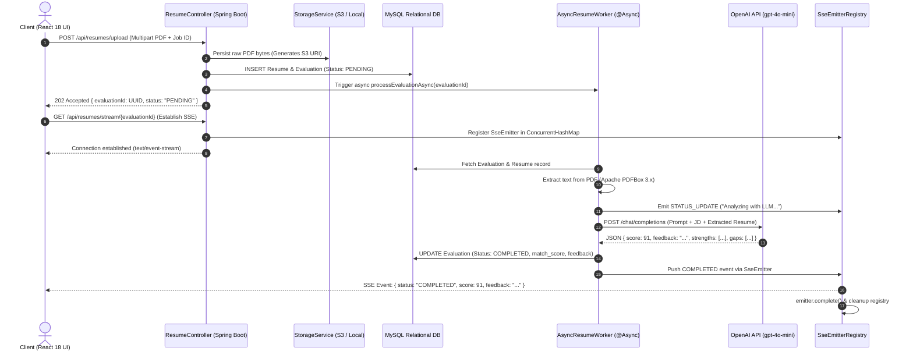

# ⚡ HireScope AI &mdash; Enterprise AI Resume Screener &amp; Applicant Tracking System

[](https://www.oracle.com/java/)
[](https://spring.io/projects/spring-boot)
[](https://spring.io/projects/spring-data-jpa)
[](https://www.mysql.com/)
[](https://react.dev/)
[](https://html.spec.whatwg.org/multipage/server-sent-events.html)
[](https://openai.com/)

An enterprise-grade, asynchronous **AI-Powered Resume Screener & ATS** engineered with **Spring Boot 3**, **React 18**, **Server-Sent Events (SSE)**, **Apache PDFBox**, and **OpenAI API**.

Designed specifically to eliminate **Servlet Thread Starvation** and **Connection Timeouts** during multi-second LLM evaluations by implementing the **Asynchronous Request-Reply Pattern (HTTP 202 Accepted)** combined with reactive real-time event streaming.

---

## 🌐 Live Deployments & Repository
- **Permanent Live Demo (GitHub Pages)**: [https://ganesh-badar.github.io/ai-resume-screener-ats/](https://ganesh-badar.github.io/ai-resume-screener-ats/)
- **GitHub Repository**: [https://github.com/ganesh-badar/ai-resume-screener-ats](https://github.com/ganesh-badar/ai-resume-screener-ats)

---

## 🏛️ System Architecture & Workflow



---

## 💡 Key Architectural Design Decisions & Interview Highlights

### 1. Why Server-Sent Events (SSE) instead of WebSockets?
- **Unidirectional Workflow**: The resume screening flow is strictly server-to-client: the client uploads a document, and the server pushes incremental updates until completion.
- **Lower Protocol Overhead**: WebSockets require full-duplex protocol negotiation, custom heartbeat protocols, and sticky sessions. SSE operates over standard HTTP/1.1 or HTTP/2, traverses enterprise firewalls without special upgrades, and provides built-in browser reconnection (`EventSource`).

### 2. Eliminating Thread Starvation via HTTP 202 Accepted & `@Async`
- Document parsing and LLM inference take 2–8 seconds. Keeping a synchronous HTTP request blocked ties up Tomcat's servlet threads (default max 200). Under heavy concurrent uploads, this results in thread starvation and 504 Gateway Timeouts.
- By returning **HTTP 202 Accepted** immediately, HTTP connections close in `< 50ms`.

### 3. Bounded Thread Pool Protection (`ThreadPoolTaskExecutor`)
- Never use Spring's default `SimpleAsyncTaskExecutor` (which spawns an unbounded thread per request risking OutOfMemoryError).
- We configure a dedicated `ThreadPoolTaskExecutor` (Core: 5, Max: 20, Queue: 100) with `CallerRunsPolicy` to enforce natural backpressure.

---

## 🗄️ Relational Database Schema (MySQL 3NF)

```sql
CREATE DATABASE ats_db CHARACTER SET utf8mb4 COLLATE utf8mb4_unicode_ci;
USE ats_db;

-- 1. Users Table
CREATE TABLE users (
    id BIGINT AUTO_INCREMENT PRIMARY KEY,
    email VARCHAR(255) NOT NULL UNIQUE,
    full_name VARCHAR(150) NOT NULL,
    role ENUM('CANDIDATE', 'RECRUITER', 'ADMIN') NOT NULL DEFAULT 'CANDIDATE',
    created_at TIMESTAMP DEFAULT CURRENT_TIMESTAMP,
    INDEX idx_user_email (email)
) ENGINE=InnoDB;

-- 2. Jobs Table
CREATE TABLE jobs (
    id BIGINT AUTO_INCREMENT PRIMARY KEY,
    title VARCHAR(200) NOT NULL,
    department VARCHAR(100),
    job_description TEXT NOT NULL,
    created_at TIMESTAMP DEFAULT CURRENT_TIMESTAMP
) ENGINE=InnoDB;

-- 3. Resumes Table
CREATE TABLE resumes (
    id BIGINT AUTO_INCREMENT PRIMARY KEY,
    user_id BIGINT NOT NULL,
    file_name VARCHAR(255) NOT NULL,
    s3_key VARCHAR(500) NOT NULL,
    s3_url VARCHAR(1000) NOT NULL,
    file_size_bytes BIGINT NOT NULL,
    content_type VARCHAR(100) DEFAULT 'application/pdf',
    created_at TIMESTAMP DEFAULT CURRENT_TIMESTAMP,
    CONSTRAINT fk_resumes_user FOREIGN KEY (user_id) REFERENCES users (id) ON DELETE CASCADE
) ENGINE=InnoDB;

-- 4. Evaluations Table
CREATE TABLE evaluations (
    id VARCHAR(36) PRIMARY KEY, -- UUID v4 identifier
    resume_id BIGINT NOT NULL,
    job_id BIGINT NOT NULL,
    status ENUM('PENDING', 'PROCESSING', 'COMPLETED', 'FAILED') NOT NULL DEFAULT 'PENDING',
    match_score INT NULL CHECK (match_score BETWEEN 0 AND 100),
    feedback_summary TEXT NULL,
    raw_ai_response TEXT NULL,
    error_message VARCHAR(500) NULL,
    created_at TIMESTAMP DEFAULT CURRENT_TIMESTAMP,
    updated_at TIMESTAMP DEFAULT CURRENT_TIMESTAMP ON UPDATE CURRENT_TIMESTAMP,
    CONSTRAINT fk_evaluations_resume FOREIGN KEY (resume_id) REFERENCES resumes (id) ON DELETE CASCADE,
    CONSTRAINT fk_evaluations_job FOREIGN KEY (job_id) REFERENCES jobs (id) ON DELETE CASCADE,
    INDEX idx_evaluation_status (status)
) ENGINE=InnoDB;
```

---

## 🚀 Quickstart & Local Setup

### Prerequisites
- **Java 17+** & **Maven 3.8+**
- **Node.js 18+** & **npm**
- *(Optional)* **Docker & Docker Compose** for MySQL

### 1. Run the Spring Boot Backend
```bash
cd backend
mvn spring-boot:run
```
*The backend starts on `http://localhost:8080`. By default, it runs with zero-dependency H2 In-Memory mode and pre-seeds sample job requisitions.*

### 2. Run the React Frontend
```bash
cd frontend
npm install
npm run dev
```
*The Vite development server starts on `http://localhost:5173`.*

---

## 📄 License
This project is open-source under the [MIT License](LICENSE).
